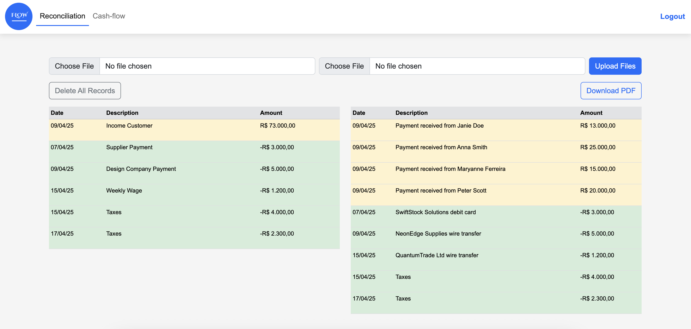
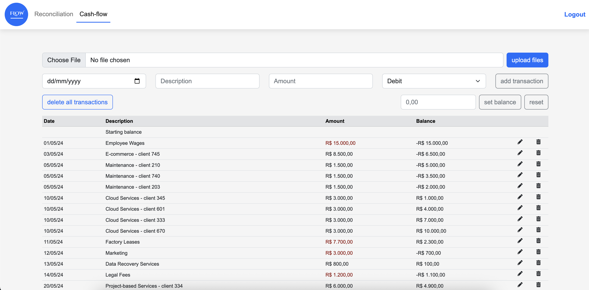

# 📊 FLOW Finance Reconciliation

A Ruby on Rails application to manage and reconcile financial data with ease.

## 🛠️ Tech Stack

- **Ruby version:** `3.3.5`
- **Rails version:** `~> 7.1.1`

## 🧩 Key Gems

The app makes use of several powerful gems to enhance its capabilities:

| Gem              | Purpose                                                         |
| ---------------- | --------------------------------------------------------------- |
| `pg`             | PostgreSQL adapter for ActiveRecord                             |
| `puma`           | Fast and concurrent web server for Ruby/Rails                   |
| `turbo-rails`    | Enables fast SPA-like navigation with Hotwire                   |
| `stimulus-rails` | Adds reactive behavior through lightweight JavaScript framework |
| `jbuilder`       | Helps build JSON responses for APIs                             |
| `bootstrap`      | CSS framework for responsive UI design                          |
| `devise`         | Provides robust user authentication                             |
| `dotenv-rails`   | Loads environment variables from `.env` files                   |
| `grover`         | Converts HTML pages into PDF documents                          |
| `csv`            | Enables reading from and writing to CSV files                   |

Dev and test gems:

- `web-console`, `debug`, `capybara`, `selenium-webdriver`, `mocha`, `rails-controller-testing`

## 📦 System Dependencies

Make sure to install these before running the app:

- [`bootstrap`](https://github.com/twbs/bootstrap), `~> 5.2.3`
- [`simple_form`](https://github.com/heartcombo/simple_form)

## 🚀 Getting Started

To set up the project locally in development mode:

```bash
git clone https://github.com/sabrinamaral/finance_reconciliation
cd finance_reconciliation
bundle install       # Install Ruby gems
yarn install         # Install JavaScript packages
rails db:create      # Create the database
rails db:migrate     # Run migrations
rails server         # Start the server
```

Access the app at [http://localhost:3000](http://localhost:3000)

## 📋 Features Section

### ✨ Features

- User authentication via Devise
- Upload financial data in CSV format
- View and reconcile financial transactions
- Interactive cash flow - add, change, or delete transactions
- Export reports as PDF (powered by Grover)
- Responsive UI with Bootstrap

## 🧪 Testing Instructions

This app includes a test suite using Minitest.

### 🧪 Running Tests

To run all tests:

```bash
rails test
```

## 🔧 Configuration

### 🔧 Environment Configuration

Create a `.env` file in the root directory with the following variables:

```
DEVISE_SECRET_KEY=your_devise_secret_key
RESET_PASSWORD_EMAIL=email@email.com (add an email to reset the users' app passwords)
PG_USER=your_postgres_user
PG_PASSWORD=your_postgres_password
PG_HOST=your_postgres_host
```

### 🖼️ Screenshots




### 🚀 Deployment Instructions

If you would like to deploy it in Render, just add this command to the project Build Command

```
./bin/render-build.sh
```

And this command to the Start Command field:

```
./bin/rails server
```

⚠️ Don't forget to add your environment variables.

### 🪪 License

This project is licensed under the MIT License.
